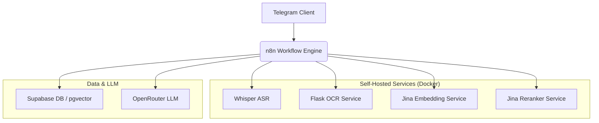

# Telegram RAG-чатбот: Автоматическая векторизация контента с Late Chunking
> Этот репозиторий подготовлен как **портфолио-кейс**: его задача – продемонстрировать навыки системного проектирования, ML-инженерии и DevOps.

---

> **Почему это не «ещё один RAG»**
>
> • **Late Chunking с RU адаптацией** – адаптировал Jina LateChunking под русский язык и модель `jina-embeddings-v3` c `adapter_mask` для задач `retrieval.query / retrieval.passage` (запрос/документ) . Токенизируем весь текст одним проходом → Transformer → mean-pooling по спанам. Сохраняем суть документа в каждом чанке.
>
> • **Двухэтапный поиск (ANN + Reranker)** - HNSW-поиск по косинусному сходству, затем кросс-энкодер`jina-reranker-v2-base-multilingual` для уточнения результатов
>
> • **Docker-образ c Flash-Attention (CUDA 12.6)** – до ×2 ускорение инференса без потери точности.
>
> • **Единый REST-эндпоинт** обрабатывает и документы (разбивая на чанки по выбранной стратегии), и запросы + готовая интеграция в n8n (ингест → pgvector → rerank → LLM).

Данный репозиторий содержит полную реализацию **RAG (Retrieval-Augmented Generation) системы** на базе **n8n**, ключевой особенностью которой является продвинутая **стратегия векторизации данных "Late Chunking"** и автоматизированный конвейер для загрузки трех видов контента: видео, веб-страниц и PDF-документов.

Система построена на базе n8n в роли оркестратора, а все ML-сервисы (ASR, OCR, Embedding, Reranker) развернуты на локальном GPU-сервере, что обеспечивает контроль над данными без зависимости от внешних API.

---

### Демонстрация работы

**[➡️ Краткий видео-обзор](https://youtu.be/v9IaeoolZ0M)**

---

### Принцип работы системы

Процесс работы разделен на два основных цикла: **индексация контента** и **генерация ответа**.

1. **Индексация:** Пользователь отправляет в Telegram ссылки, документы или видео. Система автоматически извлекает, очищает, разбивает на чанки и векторизует контент методом "Late Chunking", сохраняя его в базе данных Supabase.

2. **Генерация ответа (RAG):** На вопрос пользователя запускается двухэтапный поиск по базе знаний:

   - **Первичный векторный поиск (ANN):** Быстрый поиск по HNSW-индексу в Supabase для нахождения широкого набора релевантных кандидатов.
   - **Реранжирование (Reranking):** Кандидаты пропускаются через локальную модель `jinaai/jina-reranker-v2-base-multilingual` для дополнительной оценки кросс-энкодером для уточнения результатов и подготовки к финальной оценке.

   Ответ, генерируемый LLM, основывается **(grounding)** исключительно на информации, полученной после реранжирования, и **сопровождается ссылками на источники**, извлеченными из метаданных чанков.

---

### Ключевые архитектурные и технические решения

Проект сфокусирован на решении классических проблем RAG-систем через конкретные инженерные подходы.

#### 1. Улучшение релевантности: Late Chunking и двухэтапный поиск

- **Реализация "Late Chunking":** Вместо "стандартного" чанкинга (разбиение текста *до* векторизации), который разрушает семантические связи, используется более продвинутый подход. Весь документ целиком передается в собственный Flask-сервис (`jina_service`), где модель `jina-embeddings-v3` генерирует "сырые" токен-векторы для всего текста. Каждый токен получает векторное представление, "зная" о своем глобальном контексте. Только после этого, на основе выбранной стратегии (предложения, абзацы или кол-во токенов), логика `LateChunker` агрегирует эти токен-векторы в эмбеддинги для более крупных чанков методом `mean pooling`. Это позволяет сохранять смысл исходного документа в каждом чанке полученном чанке.

- **Двухэтапный ретривал с гибридным скорингом:** Финальный список для LLM формируется на основе **гибридного балла**, учитывающего как оценку реранкера, так и изначальную векторную близость. Это позволяет находить и высоко оценивать фрагменты, которые могли быть недооценены на одном из этапов.

  Для более точного контроля над процессом разделения контента на чанки в системе реализованы различные стратегии:
  - **`paragraph`**: Разделение по абзацам. Оптимально для статей, книг, DOC/PDF документов, сохраняя логическую структуру.
  - **`sentence`**: Разделение по предложениям. Подходит для транскрипций видео или диалогов.
  - **`fixed`**: Разделение на чанки фиксированного размера (в токенах) с настраиваемым перекрытием. Предоставляет максимальный контроль для неструктурированного текста или очень длинных документов.

  Выбор стратегии осуществляется через параметр `strategy` при вызове эндпоинта `/embed_late_chunk` в сервисе `jina_service`, что позволяет адаптировать процесс чанкирования под специфику различных типов контента и улучшить точность ретривала.

#### 2. Обработка данных: асинхронный конвейер

- **Мультимодальный Ingestion:** Система обрабатывает различные типы источников из одного пользовательского сообщения:

  - **Видео (YouTube):** Локальная транскрибация через `Whisper ASR`. Стабильность работы обеспечивается скриптом для yt-dlp с автоматическим обновлением `cookies.txt` через фоновый Selenium-скрипт, что позволяет обновлять куки автоматически.
  - **Веб-страницы:** Интеллектуальный скрапинг и очистка контента через сервис Firecrawl (SaaS, используется для демонстрации; при желании легко заменить на self‑hosted crawler).
  - **Документы (PDF, DOCX, TXT):** Извлечение текста через отдельный Flask-сервис на связке **PyMuPDF + Tesseract OCR**, что позволяет извлекать текст не только из текстовых слоев, но и **напрямую с изображений внутри документов**.

- **Синхронизация потоков:** Специальный узел-шлюз `Gatekeeper` в n8n решает проблему асинхронности: он удерживает выполнение до тех пор, пока все части одного входящего запроса не будут полностью обработаны, и только затем передает единый пакет данных на следующий этап.

#### 3. Инфраструктура: полный контроль над окружением

Весь проект разворачивается как набор Docker-контейнеров, управляемых через `docker-compose`. Все ML-сервисы работают на локальном GPU и используют Docker-образы, собранные для конкретных задач (например, скомпилированные с `flash-attention` для максимальной производительности).

---

### Архитектура системы

`n8n` выступает в роли оркестратора, управляя потоками данных и вызывая другие сервисы по мере необходимости.



---

### Технологии и методологии

| Категория             | Технология / Методология                   | Назначение                                    |
| --------------------- | ------------------------------------------ | --------------------------------------------- |
| **AI/ML Методологии** | **RAG, Late Chunking, Prompt-Engineering** | Основа системы, методы обработки и генерации. |
| **Оркестрация**       | **n8n**                                    | Реализация бизнес-логики и пайплайнов.        |
| **Инфраструктура**    | **Docker, Docker Compose**                 | Контейнеризация и управление сервисами.       |
| **Интерфейс**         | **Telegram**                               | Взаимодействие с пользователем.               |
| **База данных**       | **Supabase (PostgreSQL, pgvector)**        | Хранение векторов, текстов и метаданных.      |
| **ML: Embedding**     | **Jina Embeddings v3**                     | Создание векторов.                            |
| **ML: Reranking**     | **Jina Reranker v2**                       | Повышение точности поиска.                    |
| **ML: ASR**           | **Whisper ASR (local)**                    | Транскрибация аудио из видео.                 |
| **ML: OCR**           | **PyMuPDF, Tesseract**                     | Извлечение текста из файлов и изображений.    |
| **Автоматизация**     | **Selenium**                               | Обновление сессионных cookies для `yt-dlp`.   |
| **LLM**               | **OpenRouter**                             | Гибкий доступ к различным языковым моделям.   |
| **API-сервисы**       | **Flask, Gunicorn**                        | Создание Python-сервисов для ML-моделей.      |

---

### Содержание

1. [Принцип работы системы](#принцип-работы-системы)
2. [Ключевые архитектурные и технические решения](#ключевые-архитектурные-и-технические-решения)
3. [Архитектура системы](#архитектура-системы)
4. [Технологии и методологии](#технологии-и-методологии)
5. [Детальная документация](#детальная-документация)
6. [Локальное развертывание](#локальное-развертывание)
7. [Лицензия](#лицензия)

---

### Детальная документация

Этот документ — высокоуровневый обзор. Глубокое погружение в технические детали, код и конкретные реализации находится в папке `/docs`.

- **➡️** [Архитектура](./docs/01_architecture.md): Подробный разбор каждого сервиса и их взаимодействия.
- **➡️** [Конвейер приёма данных](./docs/02_ingestion_pipeline.md): Детальное описание конвейера приёма данных.
- **➡️** [Эмбеддинг и реранжирование](./docs/03_embedding_and_reranking.md): Технический разбор «Late Chunking» и гибридного скоринга.
- **➡️** [Логика чата и промпт-инжиниринг](./docs/04_rag_and_chat.md): Логика управления чатом и системные промпты.
- **➡️** [Late Chunking & стратегии](./docs/05_chunking_strategy.md): Детали алгоритма и рекомендации по выбору стратегии.
- **➡️** [База данных](./docs/06_database.md): Схема БД, индексы и SQL-функции.
- **➡️** [Развёртывание](./docs/07_deployment.md): Инструкции по развертыванию и описание Docker-образов.
- **➡️** [Late Chunking Demo](./latechunking_demo.md): Текстовый вариант конкретных примеров метода.

---

### Локальное развертывание

**Требования:**

- Docker & Docker Compose
- NVIDIA GPU с установленным NVIDIA Container Toolkit
- Git

1. **Клонируйте репозиторий:**

   ```bash
   git clone [https://github.com/new](https://github.com/new)
   cd rag-telegram-latechunk
   ```

2. **Настройте переменные окружения:** Скопируйте `.env.example` в `.env` и заполните необходимые токены и URL.

3. **Соберите и запустите сервисы:**

   ```bash
   docker compose -f deploy/docker-compose.yml up --build -d
   ```

   *Примечание: после запуска n8n будет доступен по адресу `http://localhost:5678` (если раскомментирован блок `ports:`). Импортируйте готовые workflow-файлы из папки `workflows/`, чтобы сразу получить рабочий пайплайн.*

---

### Что бы сделал по-другому и что бы добавил

Учитывая что это один из первых кейсов, сейчас  бы я сделал так:

- Переписал оркестрацию на LangChain + LangGraph для асинхронности и снижения p95.

- Добавил веб-интерфейс с стримингом ответа и Markdown-рендером (код/таблицы/ссылки).

- Ввел полноценную обработку ошибок (retry/backoff, timeouts, fallback-ветки).

- Продумал распределение нагрузки: отдельные воркеры ingestion/OCR/ASR/эмбеддингов, очередь задач, авто-масштабирование.

---

### Лицензия

Проприетарная, права только на чтение/запуск.

