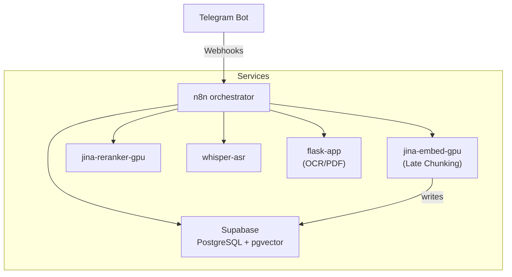

# Архитектура системы RAG-чат-бота для Telegram

> Этот документ описывает **общую архитектуру** проекта: какие сервисы задействованы, как они взаимодействуют и какие ключевые инженерные решения лежат в основе.

## 1. Высокоуровневый обзор

Система построена по принципу **микросервисной архитектуры**, каждый сервис развёрнут в отдельном контейнере Docker и управляется единой конфигурацией `docker-compose`. Оркестрация бизнес-логики выполняется через **n8n**.

Основные цели архитектуры:

1. **Полный офлайн-контроль**: все ML-модели работают локально на GPU, нет зависимости от сторонних SaaS для эмбеддинга/реранжирования/ASR/OCR.
2. **Горизонтальная расширяемость**: каждый сервис можно масштабировать независимо (напр. поднять дополнительный экземпляр `jina-embed-gpu`).
3. **Чёткое разделение ответственности**: ingestion, обработка текста, хранение векторов и генерация ответов отделены друг от друга, что упрощает отладку и дальнейшее развитие.

## 2. Состав компонентов

| Категория | Сервис (контейнер) | Обязанность |
|-----------|-------------------|-------------|
| Оркестрация | `n8n` | Управление Telegram-ботом, запуск ingestion-конвейера, выполнение RAG-поиска и генерация ответов. |
| Векторизация | `jina-embed-gpu` | Модель `jinaai/jina-embeddings-v3` с кастомной логикой **Late Chunking** (см. `chunker.py`). |
| Реранжирование | `jina-reranker-gpu` | Кросс-энкодер `jinaai/jina-reranker-v2-base-multilingual`. |
| ASR | `whisper-asr` | Автоматическая транскрибация аудио. |
| OCR / PDF | `flask-app` | Извлечение текста и OCR изображений в документах (PyMuPDF + Tesseract). |
| БД | Supabase (PostgreSQL + pgvector) | Хранение векторов, текста, истории чата, пользовательских состояний. |
| Прокси | Nginx Proxy Manager | SSL-терминация и маршрутизация запросов во внутренние сервисы. |

### Вспомогательные скрипты

* `tools/update_cookies.py` – автоматическое обновление `cookies.txt` для `yt-dlp`, чтобы YouTube не резал битрейт.
* `scripts/extract_text.py` – CLI-утилита для извлечения текста+OCR из PDF.

## 3. Потоки данных

### 3.1 Индексация контента (Ingestion)

1. Пользователь присылает сообщение (ссылку / файл / видео) в Telegram-бот.
2. **n8n** (`Classificator`, `Split & Tag`, `Gatekeeper`) определяет типы входов и запускает параллельные ветки:
   * `web` – скрапинг через Firecrawl API, затем очистка текста.
   * `video` – скачивание аудио `yt-dlp` → транскрибация `whisper-asr` → очистка.
   * `file` – скачивание из Telegram → `flask-app` (PyMuPDF+OCR) → очистка.
3. Узел **Clean & Format** нормализует текст (удаляет мусор, объединяет абзацы).
4. Узел **AI Agent** выполняет предварительное **семантическое** чанкинг-планирование: определяет оптимальную стратегию (paragraph/sentence) и формирует массив строк-чанков. Output parser работает нативно, упрощая пост-обработку до одной ноды.
5. Узел **HTTP Request → /embed_late_chunk** отправляет текст(ы) в `jina-embed-gpu`, где
   * выполняется *однократная* токенизация,
   * рассчитываются «глобальные» токен-вектора,
   * методом `LateChunker` выполняется mean-pooling по спанам токенов → эмбеддинги чанков.
6. Узел **Results** формирует JSON с эмбеддингами + метаданными и пушит данные в таблицу `documents_paragraphs` Supabase.

### 3.2 Генерация ответа (RAG-цикл)

1. Пользователь пишет вопрос в режиме «Чат».
2. **n8n** собирает последние X пар сообщений из таблицы `chat_messages` (история).
3. Узел **RAG CHATBOT (AI Agent)** анализирует вопрос и решает, нужен ли поиск в базе.
4. При необходимости вызывается tool-workflow **rag-db-query**:
   1. `/embed_late_chunk` генерирует *query embedding* (`task = retrieval.query`).
   2. RPC `search_documents` (HNSW) возвращает top-30 кандидатов, Top-K.
   3. `/rerank` пересортировывает и обрезает до 10 фрагментов, Top-N.
   4. Возвращаются `paragraph_text`, `source_type`, `source_identifier`, `retrieval_score`.
5. LLM формирует ответ, *обязательно* включает блок «Информация была взята из базы…» (grounding).
6. Ответ отправляется пользователю и пара `user/assistant` логируется в `chat_messages` (с функцией `insert_and_trim_pairs`).

## 4. Docker-инфраструктура

*Все GPU-зависимые сервисы используют Docker base-image `nvidia/cuda:12.6.1` и запускаются с `driver: nvidia` в `deploy.resources`, все колеса собраны самостоятельно.*

## 5. Ключевые инженерные особенности

1. **Late Chunking** — минимизирует потерю глобального контекста: текст токенизируется целиком, pooling выполняется по вычисленным спанам.
2. **Двухэтапный поиск** — ANN → Cross-Encoder, плюс гибридный скоринг 0.2*ANN + 0.8*Rerank.
3. **Supabase RPC** — тяжёлый поиск инкапсулирован в SQL-функцию `search_documents`, что упрощает вызов из n8n.
4. **Gatekeeper pattern** — гарантирует, что все части мульти-запроса обработаны, прежде чем писать в БД.
5. **Авто-обновление cookies** — Selenium-скрипт поддерживает живые cookies для YouTube, избегая 429/403.

## 6. Расширение и кастомизация

* Модели легко заменить: достаточно изменить `MODEL_NAME` и зеркалировать переменные окружения.
* Поддержка новых типов источников достигается добавлением веток в n8n (ingestion pipeline).
* Можно переключить LLM на полностью локальную модель (например, llama-cpp-server) без изменений пайплайна.

---

Следующий документ: **02_ingestion_pipeline.md** – подробно о каждом шаге приёма и подготовки данных.
