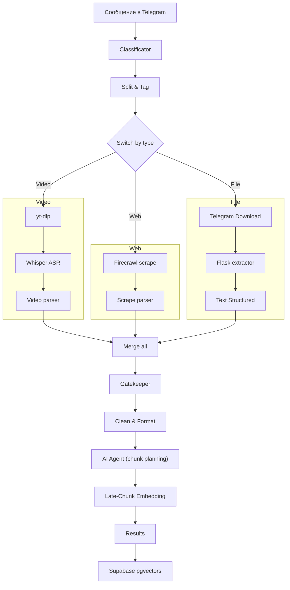

## 2. Детальное описание конвейера приёма данных

> В этом разделе разбирается **каждый шаг** pipeline, который превращает «сырой» пользовательский ввод (ссылку, видео или документ) в очищенные абзацы с эмбеддингами, готовые к поиску.

### 2.1 Общий поток



*Цветом на схеме выделены три параллельных ветки* — **Video**, **Web** и **File**. Узел **Gatekeeper** гарантирует, что **все** ветки, относящиеся к одному сообщению, завершились, прежде чем данные пойдут дальше.

---

### 2.2 Классификация входа (Classificator)

Первая `Code`-нода в n8n анализирует json от `Telegram Trigger` и формирует массив `items`, где каждый элемент имеет поля:

* `type` — `video` | `web` | `file`
* `url` / `file_id` / `file_name` — идентификаторы исходника

### 2.3 Split & Tag

Добавляет два служебных поля:

* `batch_id` — id исполнения для склейки потоков.
* `expected_map` — счётчик, сколько элементов каждого типа должно прийти (например `{ web:2, video:1 }`).

Это позволяет позднее Gatekeeper-у понять, готова ли партия целиком.

### 2.4 Ветки обработки источников

#### 2.4.1 Web-ветка

1. **Firecrawl Scrape** — SaaS-scraper получает контент с веб-страницы.
2. **Scrape Parser** — чистит ` ```json ` обёртку, извлекает `title`, `language`, `text`.
3. Ошибки ловятся `Error check` и, при необходимости, отправляются пользователю.

#### 2.4.2 Video-ветка

1. **yt-dlp** вытягивает аудио и сохраняет временный `.mp3` в контейнер.
2. **Whisper ASR** локально транскрибирует аудио в SRT.
3. **Video Parser** удаляет таймкоды, определяет язык, выдает в нужном формате (оставить тайм-коды в транскрибаторе было сознательным решением, в этом случае текст более структурированный)
4. Временный файл удаляется (`Temp delete`).

#### 2.4.3 File-ветка

1. **Telegram Download** получает файл по `file_id`.
2. **Flask extractor** (PyMuPDF+OCR) выполняет **комбинированное извлечение**:
   * текстовый слой страниц (`get_text`),
   * OCR-текст всех изображений на странице (`pytesseract`),
   * формирует **единый поток**, помечая границы маркерами `--- Page N ---` и `--- OCR Text from Image on Page N ---` (см. `scripts/extract_text.py`).
3. **Text Structured** превращает этот размеченный поток в связный текст, удаляя служебные заголовки и сохраняя естественный порядок «текст → изображения».  
*Такая схема гарантирует, что описания схем, формул и скриншотов не потеряются и сохранятся рядом с основным текстом.*

### 2.5 Gatekeeper: синхронизация потоков

Узел `Aggregate` собирает все элементы с одинаковым `batch_id`, после чего `Gatekeeper` сравнивает фактическое количество полученных элементов с `expected_map`. Пока не придёт всё обещанное, данные не проходят дальше — это устраняет гонки при параллельной обработке.

### 2.6 Clean & Format

Мощный `Code`-блок, выполняющий:

1. Удаление boilerplate (regex-паттерны для «Back to top», «Was this page helpful?» и т. д.).
2. Нормализацию переносов строк.
3. Логическое объединение коротких строк-заголовков с последующим абзацем.
4. Простейшее определение языка (`ru`/`en`).

Вывод — структурированный, но *ещё не разбитый* на параграфы/предложения текст.

### 2.7 AI Agent: семантическое планирование чанкинга

Проблема: размер параграфов должен зависеть от типа контента. Вместо жёстких эвристик используется `AI Agent`, который:

* анализирует `Content Type` и длину текста;
* выбирает стратегию `paragraph` (250-350 слов) или `sentence`;
* возвращает JSON `{ "texts": [..], "chunking_strategy": "paragraph" }`.

Таким образом «умный» шаг переносится в LLM-промпт, упрощая дальнейшую логику.

Допустимые стратегии, которые может вернуть агент:

1. **paragraph** (по умолчанию)
   • Делит по абзацам (двойной перевод строки).  
   • Лучшая опция для структурированных документов.
2. **sentence**  
   • Делит по предложениям, подходит для длинных непрерывных абзацев.  
   • Даёт более мелкое зерно поиска.
3. **fixed**  
   • Делит на чанки фиксированного размера.  
   • Параметры `chunk_size` (в токенах) и `overlap` задают границы и перекрытие.  
   • Полезно, когда нужен равномерный охват текста.

> Эти же стратегии будут упоминаться в документах `03_embedding_and_reranking.md` и `04_rag_and_chat.md` — **не забудь** синхронизировать определения.-----------------------------------

### 2.8 Late-Chunk Embedding

Эндпоинт `/embed_late_chunk` в сервисе `jina-embed-gpu` получает массив `texts` и стратегию:

1. Токенизирует **весь** текст одним куском.
2. Вычисляет токен-векторы (модель `jinaai/jina-embeddings-v3`).
3. Агрегирует токены в чанки по `offset_mapping` → получается embedding каждого параграфа/предложения, *учитывающий глобальный контекст*.

### 2.9 Results → Supabase

`Results` формирует массив строк вида:

| поле | значение |
|------|----------|
| `paragraph_text` | Исходный текст чанка |
| `embedding` | Вектор размером 768 |
| `source_type` / `url` / `file_name` | Метаданные для цитирования |
| `retrieved_at` | ISO-таймстемп |

Узел `PUSH TO DB` вставляет данные в таблицу `documents_paragraphs` PostgREST-эндпоинтом Supabase.

---

### 2.10 Как добавить новый источник

1. В `Classificator` добавить условие распознавания (например, `image`).
2. Создать новую ветку после `Switch` с нужными шагами извлечения.
3. Вернуть итог в формате `{ text, language, … }` и подключить к `Merge all`.

Gatekeeper и вся остальная цепочка будут работать без изменений.

---

### 2.11 Ошибки и идемпотентность

* Любая ветка при нефатальной ошибке проставляет `error=true`; Gatekeeper при этом всё равно пропустит данные, но указав в Slack/Telegram alert.
* `batch_id` позволяет безопасно перезапускать workflow — дубли не попадут в БД благодаря `UNIQUE (batch_id, idx_in_batch)`.

---

Конвейер приёма данных спроектирован так, чтобы **горизонтально масштабироваться** (каждую ветку можно вынести в отдельный workflow или контейнер) и при этом оставаться **строго детерминированным** — каждая партия документов либо полностью появляется в базе, либо не появляется вовсе.

---
Следующий документ: **03_embedding_and_reranking.md** – построение эмбеддингов и второй этап поиска.
