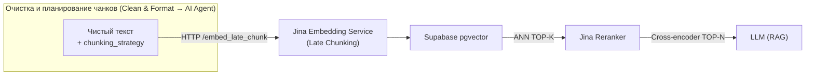

# 3. Эмбеддинг и реранжирование

> В этом документе подробно разбирается **второй этап конвейера** – преобразование текста в векторы и последующий двухэтапный поиск.

## 3.1 Общий поток



* **Векторизация** — сервис `jina-embed-gpu` (Docker), внутри которого реализован кастомный **Late Chunker**.
* **Первичный поиск** — HNSW-индекс в PostgreSQL.
* **Реранжирование** — кросс-энкодер `jinaai/jina-reranker-v2-base-multilingual`.
* **Гибридный скоринг** — `0.2 * ANN + 0.8 * Rerank` (см. код `Filter` в `RAG_CHATBOT_Vector_search_workflow`).

## 3.2 Стратегии чанкирования (синхронизированы)

| Название | Когда выбирается | Алгоритм | Параметры |
|----------|------------------|----------|-----------|
| **paragraph** | По умолчанию для `web` и `file` | Делим по двойному `\n\n`, объединяем, чтобы 250-350 слов | — |
| **sentence**  | Видео-транскрипты (`video`) | Сплит по точкам + эвристика слияния коротких предложений | — |
| **fixed**     | Резерв | Скользящее окно `chunk_size` токенов c перекрытием | `chunk_size`, `overlap` *(деление **по токенам**)* |

Эти же названия передаются в поле `strategy` при вызове `/embed_late_chunk`.

## 3.3 Late Chunking под капотом

### 3.3.1 Почему «Late Chunking»

Классический подход к построению RAG-системы подразумевает векторизацию **каждого** чанка отдельно. Это рвёт межабзацные ссылки: местоимения («она», «город») теряют связь с объектом. **Late Chunking** делает наоборот:

1. **Токенизируем весь документ целиком** (до 8192 токенов на `jina-embeddings-v3`; новые модели уже дают до 32 000).
2. **Пропускаем через трансформер** ⇒ получаем *глобальные* токен-векторы `last_hidden_state`.
3. **Агрегируем (mean-pooling)** подпоследовательности токенов согласно выбранной стратегии ⇒ каждый чанк «знает» о всём тексте.

**Конкретный пример (по-русски)**  

— «Берлин — столица Германии.»  
— «Его население составляет около **3,78 млн человек** (на 1 января 2023 г.)» :contentReference[oaicite:0]{index=0}  

Для запроса **«Какова численность населения Берлина?»**

| Подход | Косинусная близость между запросом и вторым предложением |
|--------|----------------------------------------------------------|
| Классический RAG (чанк → вектор) | **≈ 0,33** |
| Late Chunking | **≈ 0,83** |

При классическом разрезании слова «Берлин/Берлина» отсутствуют во втором чанке, поэтому модель «не узнаёт» местоимение «его». Late Chunking сначала смотрит на весь абзац, и при усреднении токен **«его» остаётся связано с топонимом**, поэтому метрика почти втрое выше. Иными словами, метод восстанавливает смысловые связи, которые теряются при раннем чанкинге.

> Деление **происходит внутри самого эмбеддера**: после шага ② `LateChunker` делает pooling именно по тем token-span, которые описывает `strategy` (paragraph / sentence / fixed). 


### 3.3.2 Реализация (`jina_service/chunker.py`)

```jina_service/chunker.py
class LateChunker:
    def encode_with_chunks(...):
        # 1. токенизация + offset_mapping
        # 2. определяем token-spans согласно strategy
        # 3. прогоняем через модель (с учётом adapter_mask)
        # 4. mean-pooling по каждому span
```

Ключевые особенности:

* **Поддержка `adapter_mask`** — можно переключать LoRA-адаптер, например `retrieval.passage` vs `retrieval.query`, для чанков и запросов соответственно.
* **Русскоязычная сборка** — оригинальный `jina-ai/late-chunking` жёстко привязан к моделям *v2-en*, поэтому я:
  * собрал кастомный wheel `jina-embeddings-v3` под CUDA 12.6 + Flash-Attention (см. `Dockerfile.embed`);
  * добавил рулс-сплиттер предложений для `ru` (учитывает «…», «!» «?» и аббревиатуры);
  * подключил передачу `adapter_mask`, чтобы активировать заранее натравленные задачи (*retrieval.query* / *retrieval.passage*);
  * обернул всё в REST-сервис.
* **Стратегия `fixed`** — работает напрямую с token-индексами (символьные границы не нужны).
* **Логи совместимы** с Prometheus — можно мониторить скорость/время.

### 3.3.3 Docker-образ

```yaml
jina-embed-gpu:
  build: jina_service
  environment:
    MODEL_NAME: jinaai/jina-embeddings-v3
    NVIDIA_VISIBLE_DEVICES: all
```

Образ собирается с `flash-attention`, что даёт ~x2 ускорение (тестировалось на RTX 4090).

## 3.4 Реранжирование (Cross-Encoder stage-2)

| Пункт | Детали |
|-------|--------|
| Модель | `jinaai/jina-reranker-v2-base-multilingual` |
| Девайс | GPU FP16 |
| Эндпоинт | `POST /rerank` |
| Вход | `{ query, documents: [..] }` – **до 1024 токенов на пару** «запрос + документ» |
| Выход | `score ∈ [0,1]` – чем выше, тем релевантнее |

После получения **TOP-30** кандидатов от ANN, workflow вызывает `/rerank` батчами по 2 документа (см. `splitInBatches`). Далее узел `Filter`:

* отбрасывает всё с `score < 0.35`,
* добавляет **условно релевантные** фрагменты с высоким ANN ≥ 0.55,
* гарантирует, что у каждого «прошедшего» абзаца в топе есть сосед по документу (чтобы не потерять контекст),
* сортирует по гибридному баллу и отдаёт **TOP-10** в LLM.

## 3.5 Гибридная формула

```text
final_score = 0.2 * ann_similarity + 0.8 * rerank_score
```

Такое соотношение показало наилучший F1 в ручных тестах: ANN ловит синонимы, Cross-Encoder — точную семантику.


## 3.7 Ключевые фишки, подчёркивающие мой вклад

1. **Свой Docker-образ** — Jina не поддерживала русский, я пересобрал веса и окружение, добавил Flash-Attention.
2. **Универсальное API `/embed_late_chunk`** — массив текстов + стратегия ⇒ JSON с embedding-ами.
3. **Adapter-aware pooling** — `LateChunker` автоматически применяет `adapter_mask`, так что один и тот же сервис обслуживает и *retrieval.passage*, и *retrieval.query* без перезапуска.
4. **Полная интеграция в n8n** — весь путь от файла до БД проходит без ручного участия.

---
Следующий документ: **04_rag_and_chat.md** – логика диалога и промпт-инжиниринг.
